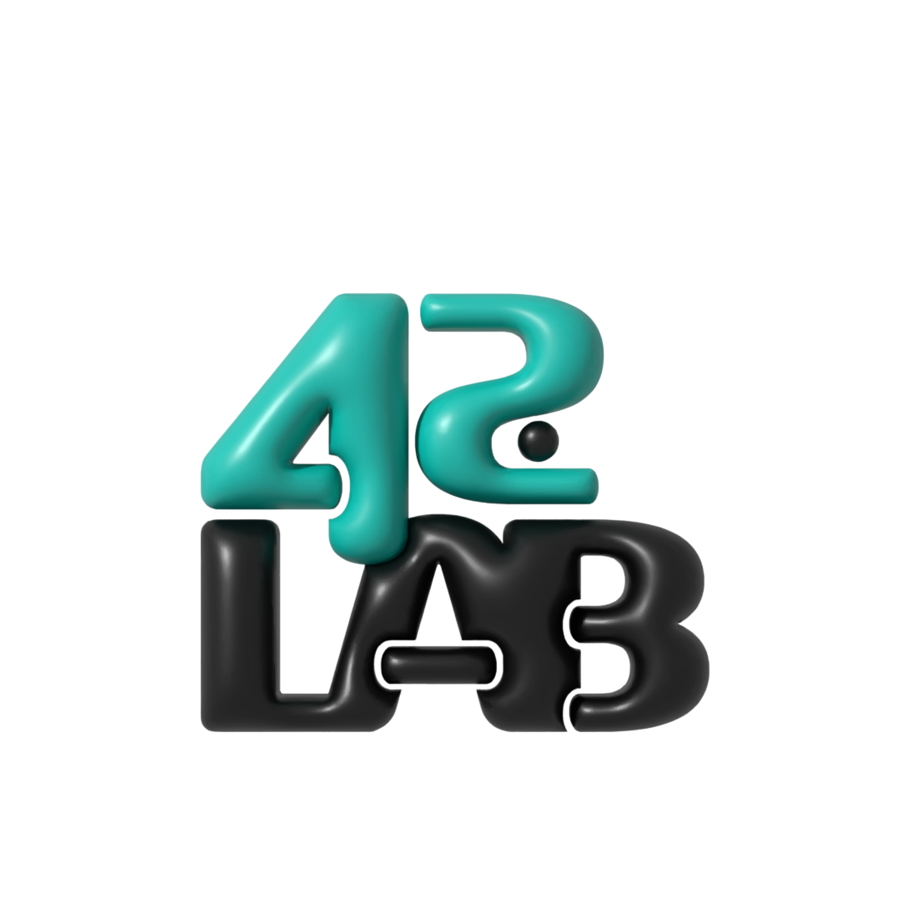

# 42LABS CV팀 과제 💡



# 실행방법
```bash
git clone https://github.com/42AILABS/team_cv_subject.git
```
- 해당 `git`저장소 clone

## 구글 코랩 실행
- `구글 코랩`에 해당 디렉토리 업로드 및 실행

## local 실행
### 가상환경 생성 
```bash
python -m venv .venv/{가상환경 이름}
```

### 가상환경 활성화(Window)

```PowerShell
.venv/{가상환경 이름}/Scripts//activate
```

### 가상환경 활성화(Mac/Linux)

```bash
source .venv/{가상환경 이름}/Scripts//activate
```

### 과제를 위한 필수 패키지 및 라이브러리 설치

clone 받은 디렉토리로 이동 후 아래 명령어 실행

```bash
pip install -r requirements.txt
```
### 주피터 노트북 가상환경 연결
```bash
python -m ipykernel install --user --name={가상환경이름} --display-name "{가상환경이름}"
```

---

# `밑바닥 부터 시작하는 딥러닝 1권 subject`
| 챕터 <br>(chapter) | 파일이름 <br>(file name) | 진행상황 (progress) |
|:-------|:---|:---:|
|`01. perceptron`| `subject/01.perceptron.ipynb`| **O** |
|`02. neural network` | `subject/02.neuralnetwork.ipynb` | **O** |
|`03. train of neural network` | | |
